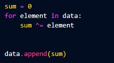
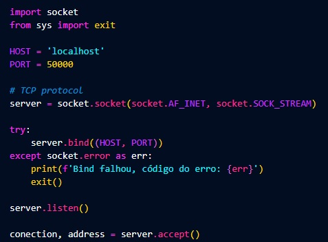
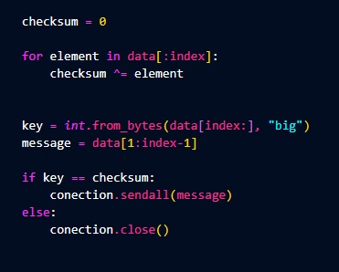

# Objetivo
Fazer uma aplicação que envie uma mensagem através da rede ethernet usando um  proprietário padrão, e outra que receba uma mensagem enviada pelo aplicativo anterior com o `protocolo proprietário`. Esse aplicativo deve verificar se a mensagem recebida está correta  ou não. Se a mensagem estiver correta, apresentar a mesma na tela e informar que a  mensagem está correta. Se a mensagem não estiver correta, apenas informar que a  mensagem está errada.

### Protocolo proprietário
    O protocolo é descrito da seguinte forma:

             |STX|Mensagem|EXT|BCC|

    STX = 0x02 ou 2
    ETX = 0x03 ou 3
    BCC é igual a operação ou-exclusivo de todos os bytes do frame do STX até o ETX.
    
# Cliente

### Conexão
Primeiramente devemos importar a biblioteca `Scocket`. Logo em seguida declaramos uma variável que irá receber o tipo de protocolo (neste caso TCP). 
Após ter definido o protocolo devemos informar um host e uma porta, para podermor realizar a conexão.

### Protocolo proprietário
Esse protocolo faz a validação de um bytearray, através de um `STX` (start-text/header) e `ETX` (end-text/footer), por exemplo:

   
A validação é realizada pelo `BCC` (binary cycle check), onde em cada byte do bytrarray é realizado um `XOR` do header, 
mensagem e footer, assim agrupando a sum junto a mensagem.

# Servidor

### Conexão
Assim como no cliente devemos importar a biblioteca `Socket`. Mas aqui também iremos importar a função exit() da biblioteca `Sys`, ela permitirá que possamos encerrar o algoritmo. Novamente definimos uma variável para a conexão e informamos o host e a porta (que devem ser os mesmos utilizados no cliente). Para testar se hosts e portas são iguais é utilizado um try/except, se os dados passados forem diferentes será enviada uma mensagem de erro para o cliente e o algoritmo será encerrado. Caso contrário será realizada a conexão.

Após conectado criaremos um loop que irá aguardar a mensagem do cliente. 

Chegou a hora de realizar o checksum, onde em cada byte do bytrarray é realizado um `XOR` do header, 
mensagem e footer. O resultado deste cálculo será comparado com o resultado do mesmo cálculo realizado do lado do cliente (chamado de key neste algoritmo). Se os resultados forem diferentes a conexão será fechada, caso contrário, será enviada uma mensagem de confirmação para o cliente.

